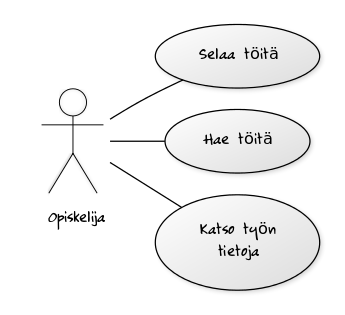
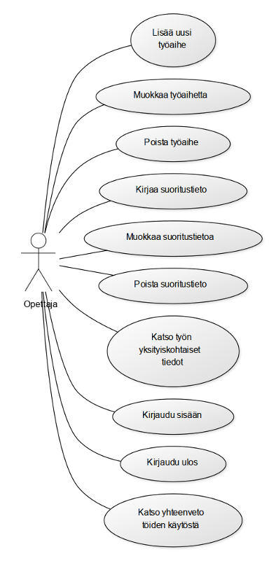
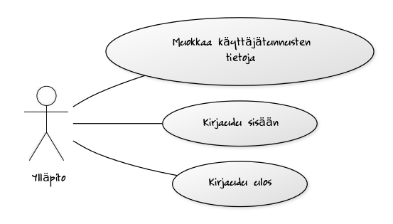
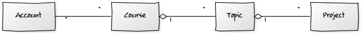
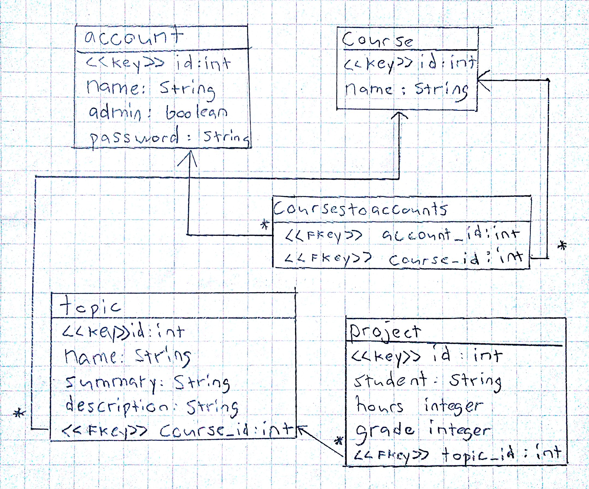
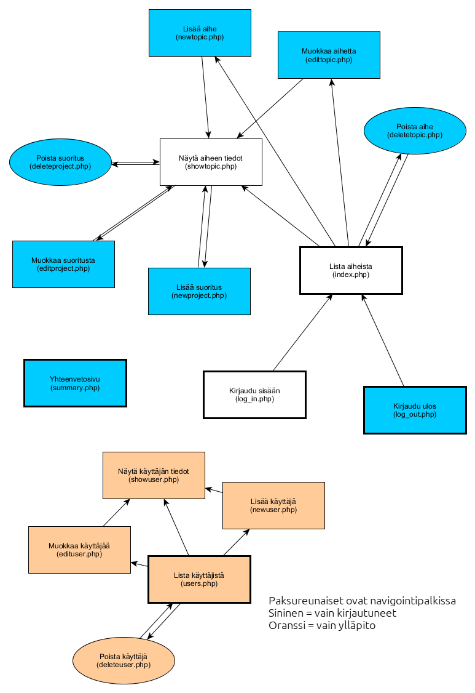

# Tietokantasovellus - dokumentaatio

## Johdanto

Työn on tarkoitus toimia harjoitustyön aiheen valintaa helpoittavana työkaluna. Sivulla listataan harjoitustyön aiheita. Sivulla näytetään kuinka monta kertaa työ on tehty, kuinka paljon siihen on kulunut aikaa ja mikä arvosana työstä on annettu. Sovelluksessa on mahdollista hallita töiden aiheita ja suoritustietoja.

Ajattelin kirjoittaa softan PHP:llä ja laittaa sen laitoksen users-palvelimelle. Tietokantana käytän PostgreSQL:ää. En aio tukea muita kantoja.

En ajatellut kirjoittaa javascriptiä tai mitään muuta erikoista sovelluksessa, eli käyttäjän selaimen ei tarvitse tukea mitään erikoista.

## Yleiskuva järjestelmästä

### Käyttötapauskaavio

\ 

\ 

\ 

### Käyttäjäryhmät

* Opiskelija: Henkilö, joka etsii harjoitustyönsä aihetta. Järjestelmä olettaa, että kaikki kirjautumattomat käyttäjät ovat opiskelijoita.
* Opettaja: Sisään kirjautunut käyttäjä, joka hallinnoi aiheita ja suoritustietoja.
* Ylläpitäjä: Etuoikeutettu käyttäjä, joka voi hallinnoi muiden tietoja.

### Käyttötapaukset

#### Opiskelija

* Selaa töitä: Käy läpi töiden listaa.
* Hae töitä: Suodattaa töitä luokittelutekijöiden mukaisesti
* Katso työn tietoja: Näyttää kuinka paljon yksittäinen työ on keskimäärin kestänyt, mikä on työn keskimääräinen arvosana ja keskeytysten lukumäärä.

#### Opettaja

* Lisää uusi työaihe: Lisätä uusi aihe opiskelijoille valittavaksi.
* Muokkaa työaihetta: Muokata töaiheen tietoja.
* Poista työaihe: Poista työaihe.
* Kirjaa suoritustieto: Kirjaa opiskelijan suorituksen tiedot.
* Muokkaa suoritustietoa: Muuta suoritusta.
* Poista suoritustieto: Poista suoritus.
* Katso työn yksityiskohtaiset tiedot: Näyttää samat tiedot kuin opiskelijalle, mutta yksityiskohtaisemmin.
* Kirjaudu sisään
* Kirjaudu ulos
* Katso yhteenveto töiden käytöstä: Näyttää hienoja tilastoja kaikista töistä

#### Ylläpitäjä

* Muokkaa käyttäjätunnusten tietoja: hallinnoi ja luo käyttäjätunnuksia.
* Kirjaudu sisään
* Kirjaudu ulos

## Järjestelmän tietosisältö

### Käsitekaavio

\ 

### Tietokohteet

* Account

|Attribuutti|Arvojoukko|Kuvaus|
|-----------|----------|------|
| Name | Merkkijono, max 20 merkkiä | Tunnuksen nimi |
| Admin | boolean | Onko tunnus ylläpitäjä |
| Password | Merkkijono, max 20 merkkiä | Tunnuksen salasana |

Tunnuksella voi olla useita kursseja.

* Course

|Attribuutti|Arvojoukko|Kuvaus|
|-----------|----------|------|
| Name | Merkkijono, max 20 merkkiä | Kurssin nimi |

Kurssi voi kuulua useammalle tunnuksella ja kursilla voi olla useita aiheita.

* Topic

|Attribuutti|Arvojoukko|Kuvaus|
|-----------|----------|------|
| Name | Merkkijono, max 20 merkkiä | Aiheen nimi |
| Course id | Kokonaisluku | Kurssin id, mihin aihe kuuluu |
| Summary | Merkkijono, max 20 merkkiä | Tiivistelmä aiheesta |
| Description | Merkkijono, max 1000 merkkiä | Aiheen kuvaus |

Aihe kuuluu yhteen kurssiin ja sillä on useita projekteja.

* Project

|Attribuutti|Arvojoukko|Kuvaus|
|-----------|----------|------|
| Topic id | integer | Aiheen id, mihin projekti kuuluu |
| Student | Merkkijono, max 20 merkkiä | Projektin tehneen oppilaan nimi |
| Hours | Kokonaisluku| Kuinka monta tuntia projektiin on käytetty |
| Työstä annettu arvosana | Kokonaisluku, 1-5 | Työstä saatu arvosana |

Projekti on yksi aiheen suoritus. Se kuuluu yhteen aiheeseen.

### Relaatiotietokantakaavio

\ 

## Käyttöliittymä

\ 

## Käynnistys- / käyttöohje

Sovelluksen esittelysivu: [http://hnygren.users.cs.helsinki.fi/tsoha/esittelysivu.html](http://hnygren.users.cs.helsinki.fi/tsoha/esittelysivu.html)
